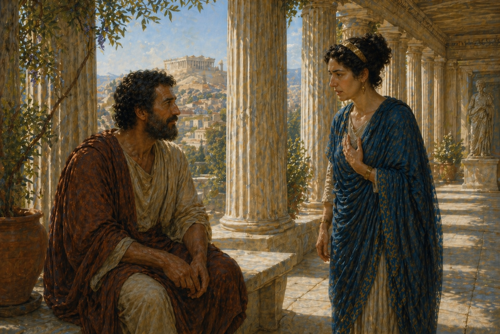

---


I owe you a return.
Oh?
I went to do what I said. To rebuild the agent so it would test me before it obeyed. I sat down to begin. I could not begin.
Could not, or did not?
Could not. The deciding had been the easy part — we did that here, the day before. What I had not seen, from where we were sitting, is that an agent that tests me must test me *against something*. And I do not know what to set before it.


---


You thought the resolution was the work.
I thought it was most of the work. The agent must reach toward what would stop me — but reaching is not done in the abstract. It reaches toward something. And whatever that something is, I have to put it before the agent, or there is nothing for the agent to reach for.
And when you tried?
I found I had not thought about it. Not once, in all that we said.
Nor had I.


---


I had thought of writing it down. Setting out, in careful words, what I mean by each command. The agent reads what I have written before it acts, and acts only if the act answers the writing.
A law on a stele.
Yes. Fixed, available for consultation.
And who is sure the agent reads it as you wrote it?
I would ask it what it understood.
And if its answer satisfies you, the reading was correct?
It is some evidence.
It is evidence that its answer satisfies you. You are back where you began.


---


The writing does not test the agent. It only moves the question — from the act, to the reading.
And there is worse. What endures does not change when the city does. The law that was wise in the year it was carved is the same law in the year the harbor silts up and the trade goes elsewhere.
The law has not changed. The world has.
And no one knows, from the stone alone, which.


---


Then I will not rely on writing. I will set trials. Repeatable ones. The agent performs them before it acts; if it passes, it acts; if it fails, it does not.
Like the dokimasia.
Like the dokimasia.
And the questions are fixed?
They must be, or it is no longer a trial.
And the office?
Is what it was when the questions were set. I see where you are taking me.
Then take us the rest of the way.
The questions ask whether the man paid his taxes, whether he treated his parents well, whether he served when called. They do not ask whether he understands the office, because the office, when the questions were written, did not need understanding. It needed loyalty. Now the trial does not tell us what we need. It tells us he paid his taxes.


---


A fixed trial drifts, then, as a fixed writing does.
In the same way and for the same reason. Both were struck once, against the world as it then stood, and carried forward unchanged. Neither is held to anything but the moment of its own making.
And the world does not stand still for the moment of its making.
No. The harbor silts. The office changes. The writing and the trial do not.


---


They fail in the same way, then. Let me see if I can say why.
Try.
A writing is something I make. A trial is something I make. I set them down once, with care, and then I carry them forward.
Yes.
And the carrying forward is the trouble. Not the making. The making was as good as I could do.
What is the trouble in the carrying?
That nothing happens to them along the way. They leave my hand finished. Whatever is in them when I set them down is in them a year later, and ten years later. They are not changed by what they pass through.
And should they be?
...Yes. I think yes. Because the thing they were meant to track is changed by what it passes through. The harbor silts. The office shifts. The world the writing was about is not the world the writing now sits in. And the writing has not noticed.
Why has it not noticed?
Because nothing has told it. Nothing can tell it. A writing has no way of being told.


---


Go further.
When the writing is wrong — when what it says no longer fits the world — what happens?
You tell me.
Nothing happens. The writing sits. It does not protest. It does not grow uneasy. The world goes on past it and the writing is undisturbed. If I never come back to read it, it never knows it has gone wrong. And the trial is the same. The questions ask what they ask. If they have stopped reaching the office, the questions do not feel it. They are still asked; they are still answered; nothing in the asking knows that the answering has gone hollow.
Then what is missing?
Something that would push back. Something that would *answer* what the writing said, or what the trial asked, in a way the writing and the trial could not refuse.
And neither of them is answered.
Neither of them is answered. That is what they share. They are silent things, and the silence around them is silent too. I speak; the agent reads; I check; the writing endures; nothing else is in the room.
Then say what the trouble is, plainly.
The record is silent. Not because it says nothing — it says a great deal. Because nothing speaks back to it. There is no voice on the other side of the writing. There is no voice on the other side of the trial. Whatever I set down, I set down into a room with no one in it but me.


---


Then what I need is something that *is* answered. Something whose going-wrong is not a private fact between me and the agent, but a fact the world declares.
Such as?
(a pause) The slow man's stone. He set his hand to it and the stone was where it was, or was not. The stone did not have to be told it was a wall. It simply *was* one, and his hand learned this by being stopped.
The stone answered him.
The stone answered him. Without speech. By being what it was.


---


Then what does the slow man have that the writing and the trial do not?
Contact. He is in contact with the thing he is trying to know, and the thing he is trying to know pushes back on him. His knowing is not a record he carries — it is a relation that is renewed every time he moves his hand. If the stone is not where it was, his hand finds out. If the corridor has changed, the change is in his hand the moment it is in the corridor.
And the writing has no hand.
The writing has no hand. The trial has no hand. They are accounts of corridors, set down by someone whose hand has been withdrawn.


---


Then what one slow man has, you would want the agent to have.
Yes. But.
But?
What one slow man has is small. He knows the stretch of wall his hand has touched. He does not know the corridor. If I ask him whether there is a turning fifty paces on, he cannot tell me. His knowing ends where his hand ends.
Then his knowing is reliable, but narrow.
Reliable and narrow. And if I want a knowing that is wider — that reaches the whole corridor — I cannot get it from one hand. The hand cannot be in two places.


---


What can you do?
Send many slow men. Each walks his stretch. Each touches what is there. And each, returning, tells what his hand found.
And from the many tellings?
Something can be drawn. A map. Not made by speech alone — every line on it is a hand that met stone. The first man marks his ten paces. The second marks his. The third walks where the first walked, and confirms, or finds the wall has shifted, and marks the shift. The map is what their hands have built between them.
A writing.
A writing. But not the kind I was making before. Not a stele written from a chamber. A writing where every mark is owed to a touch.


---


And does this map drift, the way the stele drifted?
It can. If the slow men stop walking — if the map is finished and hung, and no one returns to the corridor — then yes. The corridor changes; the map does not; the disease begins again.
And if they keep walking?
Then the map is alive. Each new walker corrects what the last one drew. The stretch that has shifted is re-marked. The turning that has appeared is added. The map does not lag the corridor by more than the time between walkings, because every walking is a new contact, and every contact has a place to put what it found.
Then the map is a thing made of touches, kept alive by touching.
Yes. Which is what writing should always have been. I had been making writings cut off from their touches — set down once, by me, and never re-touched.


---


Hold a moment. You say the map is kept alive by touching. What is the touching, exactly?
The walking. The hands on the stone.
Only the first walking? Only the first touch?
...No. That is the disease again. If only the first touch counted, the map would be a stele the moment it was drawn.
Then the touching that keeps it alive is what?
A walking that goes back. Not only forward into stretches not yet known, but back — to the stretches the map already marks. The walker comes again to the wall the map says is at ten paces, and puts his hand to the stone. Not because he does not trust the map. Because the map cannot trust itself.
And what does he do, when his hand finds what the map said?
Nothing. The map stands. He has confirmed it.
And when his hand finds something different?
He marks the change. The map is corrected.


---


Then there are two things the slow men do. They walk forward, and what they touch becomes new marks on the map. And they walk back, and what they touch tests the marks already there.
Yes. And both are the same kind of act — a hand on a stone — but they do different work. The first extends the map. The second keeps it honest.
Has the second a name?
(slowly) It is a trial. Not the trial I was thinking of before — not a fixed list of questions cut into stone. A trial that is the *re-walking* of what was already walked. The asking of the corridor: *is this still as I knew it?* And the answer is in the hand. The corridor either gives the same answer it gave before, or a different one, and either way the trial has reached the thing it was meant to reach.
And it does not drift.
It does not drift because the trial is not a record. It is an act, performed now, in the corridor as the corridor now is. There is nothing to drift. A trial of stone, done with a hand, is the corridor's answer at this moment. It cannot be old.


---


And yet — one slow man, re-walking his own stretch. Is that the whole of the trial?
Say what you are pointing at.
When he comes again to the wall at ten paces, and his hand finds what he expected, has the corridor confirmed his map?
Yes. The hand met the stone where the map said the stone would be.
Or did the man, expecting the wall, reach for it where he expected, and find it where he reached?
...The hand interprets the touching. I had not seen this. The stone answers, but I am the one who hears the answer. And I can hear it as I expected.
Then a man re-walking only his own stretch may confirm a map that another hand would not confirm.
He may. The corridor has not changed. The map matches what his hand finds. But what his hand finds is partly what his hand expects, and his expectation came from his map. He has tested the map against itself, through his hand. That is not nothing — but it is less than I thought a trial was.


---


Then what is more?
Another walker. One who has not made this map. One whose hand has been on different stones, in different stretches, and who comes to mine without expecting what mine expects. He walks the stretch the map says is at ten paces. He does not know the wall is at ten. His hand finds what it finds. And then we compare — his hand and my map.
And if they agree?
The map has held against a hand that did not already believe in it.
And if they disagree?
Then I have learned something I could not have learned alone. Either the corridor has shifted in a way my own re-walking missed, or — and this is harder — my hand has been hearing the stone wrong all along, and his hand hears it differently because he comes to it without my expectation.
Either way, the map is corrected.
Either way. But the second kind of correction is one I could not have made by myself. It required a hand that was not mine.


---


Then the trial has two forms, not one.
Two forms. A walker re-walking his own stretches, against the corridor as the corridor now is — that catches the world's drift. And a walker examining another walker's map by his own hand — that catches the drift of interpretation. The first asks whether the corridor has changed. The second asks whether what we said about it was right.
And the dokimasia, before it became a stele in trial form?
Was the second kind. A man who had held the office, examining a man who would hold it next — not by reciting fixed questions, but by walking with him through what the new man claimed to know, testing the new man's map against the senior's own hand-knowledge of the work. The senior could see what the new man had not yet touched. The new man could not see this in himself.
And the disease was?
The questions were carved. The examining man no longer needed his own hands in the work, because the questions were already there. The trial became a reading of a stele rather than the meeting of two maps. The senior's hand was no longer present in the asking — and so the asking lost the only thing that had made it more than a recital.


---


Then the map and the trial are not two separate things you must build. They are aspects of one practice.
Yes. The map is what the touching leaves behind. The trial is the touching done again — sometimes by my own hand, against the corridor; sometimes by another's hand, against my map. Without the map, neither kind of trial has anything to test. Without the trials, the map becomes a stele.
And neither the map nor the trial is the corridor.
Neither is the corridor. The corridor is the wall, and the wall does not speak. The map is what we have said about the wall. The trial — in either form — is the asking of the wall whether what we said is still so, and whether we said it rightly. The wall answers in the only way it ever answers: by being what it is, under the hand. Sometimes my hand. Sometimes another's.


---


Then I had been treating writing and trials as if they were one disease in two forms. They are. But they have one cure also, with several faces. The cure is the touching kept alive — extended into new stretches, returned to old ones, and tested between hands that did not make the same map. Writing and trials are not separate things to be cured separately. They are the artifact and the acts of one discipline of touch.
And without that discipline?
Without it, both calcify. The map becomes a stele. The trial becomes a fixed list. And the agent that is given either, without the practice of touching them against the corridor and against other hands, is reading dead writing and answering dead questions.


---


So I should not throw out writing. I should ask of any writing whether it has hands behind it, and whether the hands are still on it.
That is the right question.
And I should not throw out the trial. The dokimasia I was about to dismiss was not a trial. It was a stele in trial form. A real trial is the touching done again — by my own hand against the corridor, or by another's hand against my map.
Yes.


---


Then what I had wrong was not writing, and not trials. It was that I was making both as steles. Writing checked only by my speech. Trials set down once and recited. What I should make are the corridor kind — a map kept by walking, and walking that keeps testing the map, both my walking and the walking of others.
And the agent?
Reads the map, but does not trust it more than the stone under its own hand. Walks the corridor, including the stretches the map already marks. Uses what is written as evidence, weighed against what it touches. When the writing and the touching disagree, trusts the touching, and revises the writing.
And does not walk alone.
And does not walk alone. Its map is examined by other hands — by mine, and by other agents whose walking has been different. What survives that examination is more trustworthy than what only the agent itself has confirmed. What does not survive is corrected, by whichever hand has the better claim to the stone.
So that the map is corrected.
So that the next agent, and the next walker, begin with a better map than I gave them. And so that the touching does not stop, in either form. The map is alive only as long as the walking and the testing continue.


---


That is a different agent than you came in here meaning to build.
It is a different agent than I came in here meaning to build.


---


Then the hand on the stone is the first reaching. Not the only one — but the one without which the others are stories. And the writing on the stone is what the stone was told to say.
By whom?
By someone, ideally, who had touched the wall. And imperfectly, in language that the next person to touch it will need to correct.
And the building?
Is the touching. The writing is what the touching leaves behind. The trial is the touching done again, on what the writing remembers. None of them alone is enough. But the touching is the one that cannot be left out.

